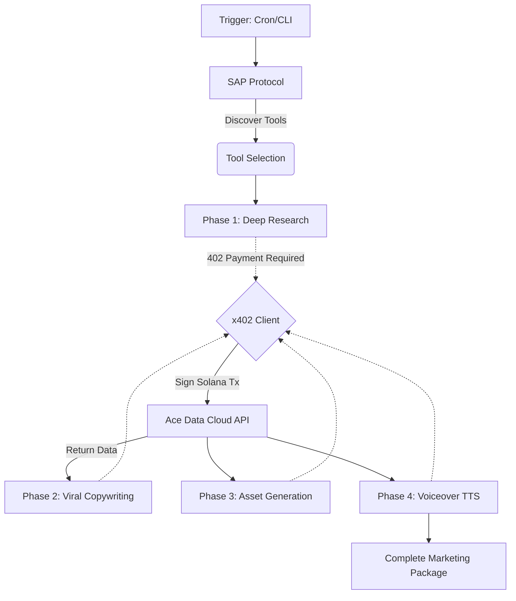

# Ace Marketer: Autonomous SAP + X402 Agent

**Ace Marketer** is a fully autonomous on-chain AI agent built for the **OOBE Protocol & Ace Data Cloud Bounty** (Category: *Ace Data Cloud Usage*).

This agent registers on the Synapse Agent Protocol (SAP) Mainnet, discovers AI tools, and executes a fully autonomous, dynamic marketing workflow (Research ➡️ Copywriting ➡️ Graphic Design ➡️ Voiceover). All API payments are seamlessly settled via the **x402 protocol** using the Ace Data Cloud payment facilitator.

## 🏆 Bounty Category: Ace Data Cloud Usage
This submission perfectly checks all the boxes for the **Ace Data Cloud Usage Category**:
✅ **Registered on SAP Mainnet**: The agent is registered and discoverable via SAP.
✅ **Automated Workflow**: End-to-end execution with zero human intervention.
✅ **X402 Payments**: Uses Ace Data Cloud's x402 payment facilitator and Synapse RPC.
✅ **3 Distinct Ace Data Cloud Services**: The agent dynamically generates:
1. **Chat Completions** (Market Research & LLM Copywriting)
2. **Image Generations** (Visual Marketing Assets)
3. **Audio/Speech Generation** (Voiceover TTS for Marketing)
✅ **Anti-Spam & Real Volume**: To ensure legitimate usage, the agent selects from a dynamic pool of trending crypto topics. It generates unique, context-aware campaigns for every run, proving real-world utility over artificial wash-trading loops.

## 🏗️ Architecture



## 🚀 Getting Started

### Prerequisites
- Node.js (v18+)
- A funded Solana Mainnet Wallet for X402 micro-transactions.
- Ace Data Cloud API Key.

### 1. Installation
```bash
git clone https://github.com/YOUR_GITHUB/ace-marketer.git
cd ace-marketer
npm install
```

### 2. Environment Setup
Create a `.env` file in the root directory:
```env
# Required for Mainnet Execution
NETWORK=mainnet
ACE_DATA_CLOUD_API_KEY=your_ace_api_key
SOLANA_WALLET_JSON_PATH=./keypair.json
RPC_URL=https://rpc.synapse.oobeprotocol.ai
```

### 3. Run the Autonomous Agent
Execute the agent pipeline. It will register on SAP (if not already), select a dynamic target, and complete the 4-phase workflow.
```bash
npm run start
```

## 🧪 Local Devnet Testing (The Mock Gateway)
To prevent spending real USDC during testing and debugging, this repository includes a custom **X402 Devnet Gateway**.
1. Set `NETWORK=devnet` in your `.env`.
2. Start the mock server: `npm run server`
3. Run the agent: `npm run start`

The local Gateway acts exactly like the production Ace Data Cloud API, issuing a `402 Payment Required` header and verifying Devnet USDC transactions on-chain before returning results.
